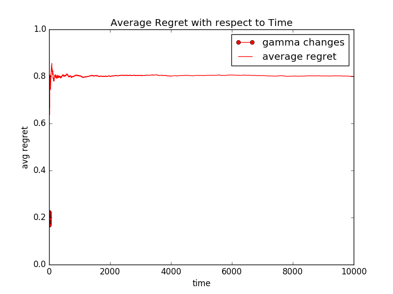
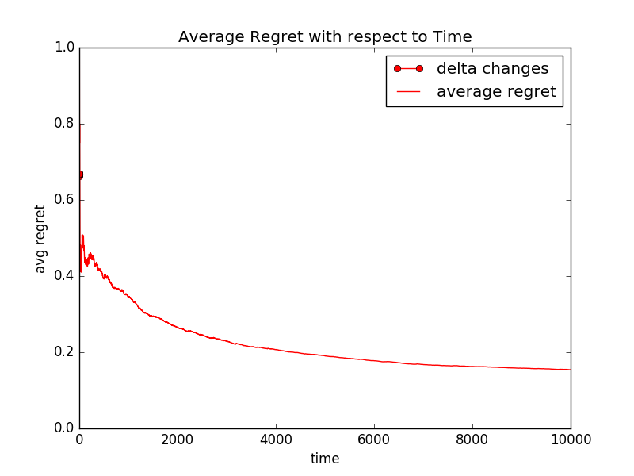
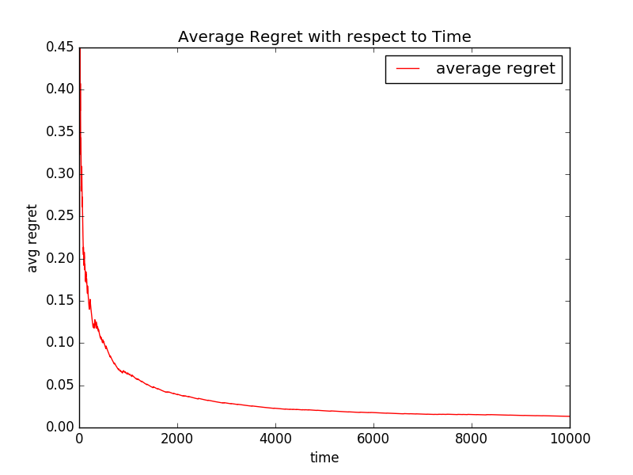
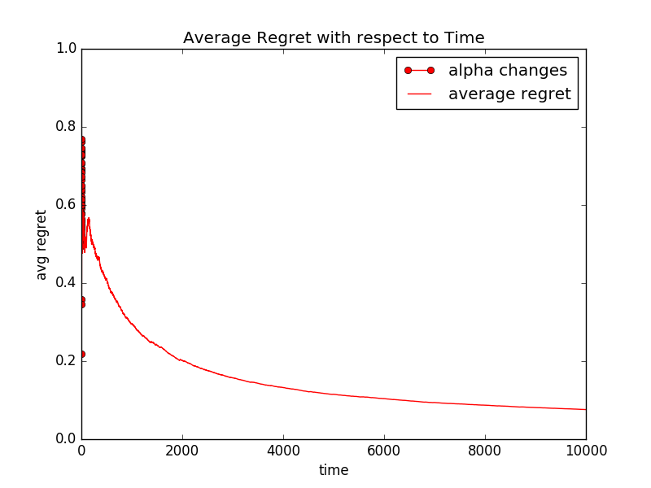
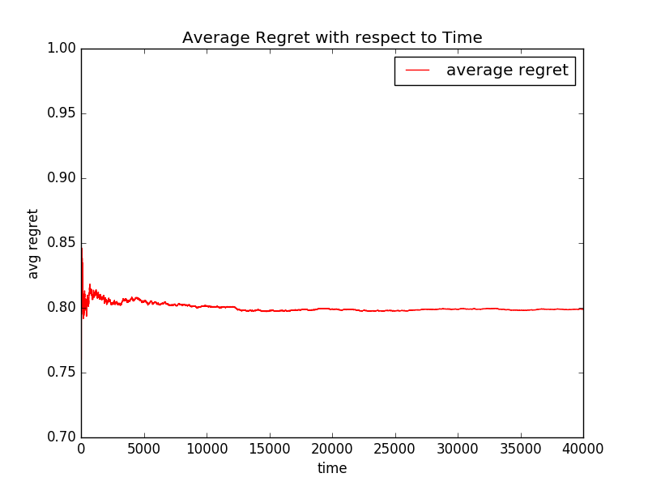

Simulations of bandits
======================

Exp3
----
Example file: :file:`simulation/simulation_exp3.py`

Exp4.P
------
Example file: :file:`simulation/simulation_exp4p.py`

Thompson sampling
-----------------
Example file: :file:`simulation/simulation_linthompsamp.py`

LinUCB
------
Example file: :file:`simulation/simulation_linucb.py`

UCB1
-----------------
Example file: :file:`simulation/simulation_ucb1.py`

